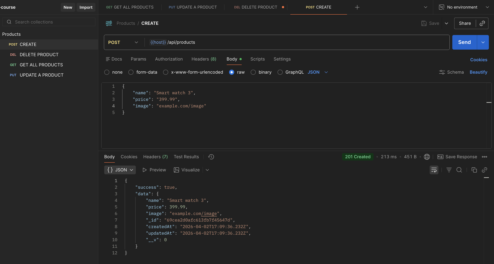
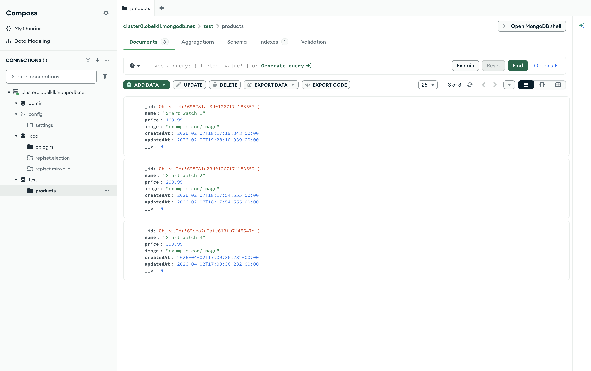
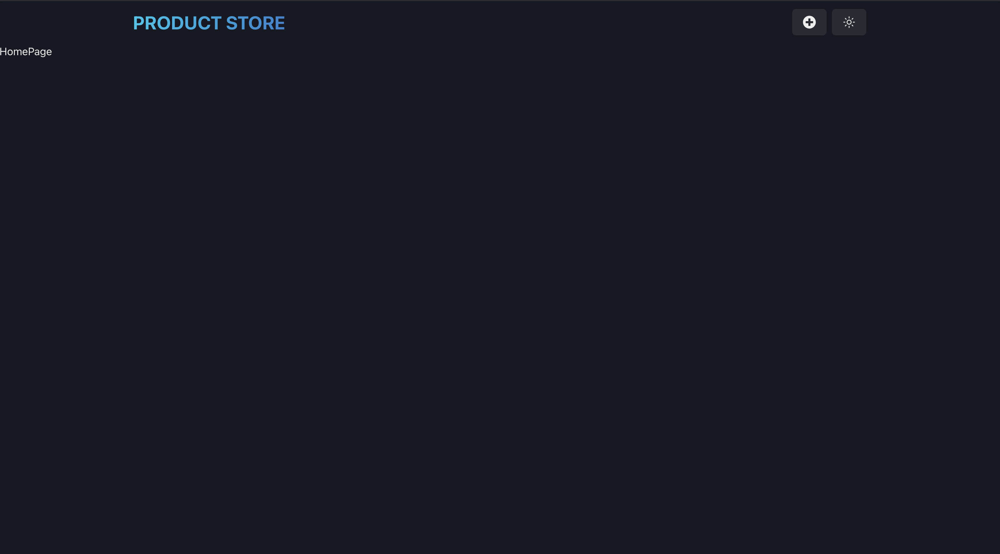
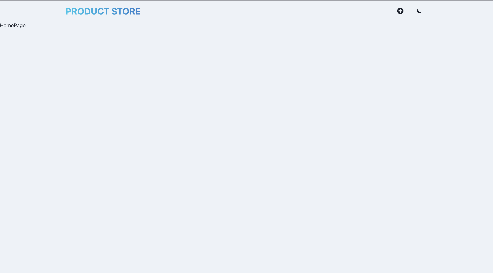

# MERN E-Commerce App

Personal project to learn the MERN stack.

---

## Overview

This application allows users to:

* Create, update, and delete products
* View product listings
* Store and retrieve data from MongoDB

---

## Tech Stack

### Frontend

* React
* Chakra UI

### Backend

* Node.js
* Express

### Database

* MongoDB (Atlas)

---

## API Endpoints

| Method | Endpoint          | Description      |
| ------ | ----------------- | ---------------- |
| GET    | /api/products     | Get all products |
| POST   | /api/products     | Create a product |
| PUT    | /api/products/:id | Update a product |
| DELETE | /api/products/:id | Delete a product |

---

## Installation

### 1. Clone the repository

```bash
git clone https://github.com/yourusername/mern-app.git
cd mern-app
```

---

### 2. Backend setup

```bash
npm install
npm run dev
```

---

### 3. Frontend setup (in a new terminal)

```bash
cd frontend
npm install
npm run dev
```

---

### 4. Environment Variables

Create a `.env` file in the root directory:

```env
MONGO_URI=your_mongodb_connection_string
PORT=3000
```

---

## Project Structure

```
mern-app/
├── backend/
│   ├── config/
│   ├── controllers/
│   ├── models/
│   ├── routes/
│   └── server.js
├── frontend/
├── README.md
```

---

## Status

* Backend API ✅
* MongoDB integration ✅ 
* Frontend UI completion

---

## Learning Goals

* Understand full-stack development
* Practice REST API design using Express
* Improve state management in React
* Learn integration between frontend and backend systems

---

## Screenshots

### Creating a product (Postman)



### MongoDB Data (Compass)



### UI - Dark Mode



### UI - Light Mode



---

## References

* MERN Stack Tutorial (YouTube):
  [https://www.youtube.com/watch?v=O3BUHwfHf84](https://www.youtube.com/watch?v=O3BUHwfHf84)

---

## Author

Samuel Lalonde
GitHub: [https://github.com/yourusername](https://github.com/yourusername)
